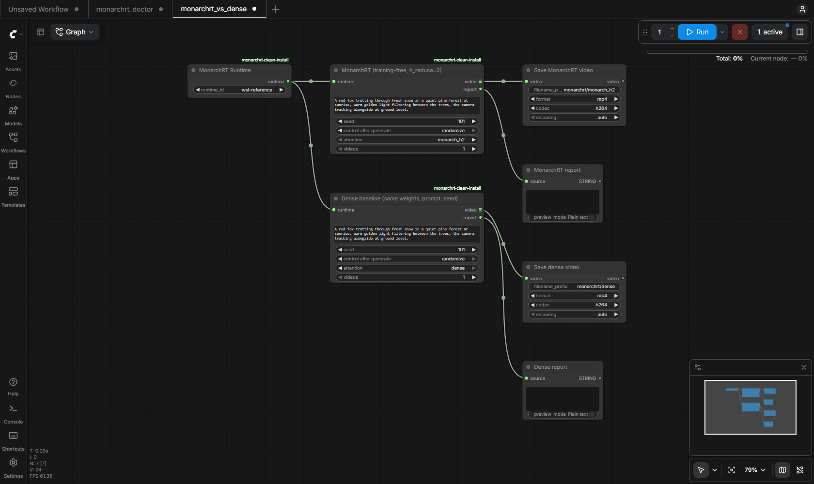

# ComfyUI-MonarchRT

Unofficial ComfyUI integration of [MonarchRT](https://github.com/Infini-AI-Lab/MonarchRT)
([paper](https://arxiv.org/abs/2602.12271), [blog](https://infini-ai-lab.github.io/MonarchRT/)),
used **training-free** on the public Self-Forcing weights. Not affiliated with
or endorsed by the MonarchRT authors, the Self-Forcing / CausVid authors,
Alibaba (Wan) or Comfy Org.

日本語の概要: [README.ja.md](README.ja.md)

MonarchRT replaces dense self-attention in video diffusion transformers with
Monarch-matrix attention and ships fused Triton kernels for it. Upstream
supports two ways to use it: with MonarchRT-trained checkpoints (not
released, see upstream issue #1) or **training-free**, by switching the
attention of the released dense
[Self-Forcing DMD checkpoint](https://huggingface.co/gdhe17/Self-Forcing)
(Wan2.1-T2V-1.3B based) at inference time. This package runs the second one
from ComfyUI, next to a dense baseline on the same weights, prompt, noise and
seed:

- **MonarchRT Runtime**: pick a runtime the administrator registered (a WSL2
  or Linux venv with the pinned upstream checkout and the weights). Workflows
  cannot name executables or commands.
- **MonarchRT Generate (Self-Forcing T2V)**: 480x832, 81 frames at 16 fps,
  1-4 videos per job (the model is loaded and the kernels are tuned once).
  Attention profiles: `monarch_h2` (default), `monarch_h1`, `dense`. Returns
  real ComfyUI `VIDEO` outputs (connect `Save Video`) and a JSON report with
  the attention dispatch actually observed, forward counts, per-phase
  timings and memory.
- **MonarchRT Doctor**: checks the runtime (upstream files against the pinned
  commit, model files, CUDA/Triton/flash-attn/FlashInfer, optional Monarch
  kernel vs reference check).


*Left to right: dense, `monarch_h2`, `monarch_h1`; same weights, prompt,
seed and initial noise. Reduced preview; the full-resolution side-by-side
MP4s and all 18 comparison videos are in the
[v0.1.0 release](https://github.com/hiroki-abe-58/ComfyUI-MonarchRT/releases/tag/v0.1.0).*

## Results (RTX 5090, WSL2, 480x832, 81 frames)

Warm runs, mean of 6 videos (3 prompts x 2 seeds) per profile, each job one
process; details, cold-start costs and raw records in
[docs/BENCHMARKS.md](docs/BENCHMARKS.md).

| Profile | Generator (35 forwards) | Inference total (text encode + generator + VAE) | Whole GPU peak (nvidia-smi) |
| --- | --- | --- | --- |
| `dense` | 6.60 s | 10.98 s | 19.1 GB |
| `monarch_h2` | 4.91 s (1.34x) | 9.47 s (1.16x) | 22.3 GB |
| `monarch_h1` | 4.17 s (1.58x) | 8.72 s (1.26x) | 22.3 GB |

- The first video of every process is much slower: Triton re-runs the Monarch
  autotune timing for each of the 7 KV-cache lengths (about 140 s in total;
  compiled kernels are cached on disk), and the first prompt encoding reads
  the 11 GB T5 file. Use `videos` > 1 to amortise this.
- Quality: with the same noise, Monarch videos are not close to the dense ones
  pixel-wise (the autoregressive rollout diverges; PSNR 12.9 dB / SSIM 0.41
  for `monarch_h2`). By eye, `monarch_h2` gave coherent videos for all 6
  prompt/seed pairs, often with less camera motion, and one video duplicated
  the main subject; `monarch_h1` was visibly weaker. This is not a quality
  benchmark, and there is no claim of parity with dense attention.
- Correctness: every self-attention call was observed in the Monarch Triton
  kernel (1050 per video, 0 dense, 0 PyTorch fallback); dense -> Monarch ->
  dense and reversed generation orders give bit-identical files, so no cache
  or patch leaks between videos or profiles.

## Attention profiles

| Profile | Upstream config | Monarch settings | Effective attention sparsity |
| --- | --- | --- | --- |
| `monarch_h2` (default) | `self_forcing_monarch_dmd.yaml` | `enable, num_iters=1, f_tied=1, h_reduce=2, w_reduce=1` | about 90%: the level of the paper's training-free results (appendix C.2), per the upstream reply in issue #2 |
| `monarch_h1` | `self_forcing_monarch_dmd.yaml` as shipped | `h_reduce=1` | about 95%: the repository default; per the same reply, training is what gives high quality at this level |
| `dense` | `self_forcing_dmd.yaml` | Monarch disabled | 0% (flash-attn) |

`num_iters=1` is the only setting that uses the fused Triton kernel
(`num_iters>1` runs a slower PyTorch path), so the profiles fix it. Cross-
attention to the text is dense in every profile. The runner counts every
self-attention call per video (30 blocks x 35 forwards = 1050) and fails the
job if any of them took a different path than the profile asks for; there is
no silent fallback from Monarch to dense.

## Status

| | Scope |
| --- | --- |
| **Tested** (real weights) | ComfyUI v0.38.0 on Windows 11 with a WSL2 Ubuntu 24.04 runtime (torch 2.8.0+cu128, triton 3.4.0, flash-attn 2.8.3, flashinfer 0.6.3), RTX 5090 32 GB. All three profiles, 480x832x81, batch 1. Through ComfyUI's HTTP API: generation with `Save Video`, Doctor, cancel, timeout and runtime errors (no process left behind, GPU memory back to idle). Clean install from `git archive` into a differently named folder. |
| **Tested** (CPU CI) | Ubuntu and Windows: config and job validation, argv/environment construction, real subprocess control with a fake runtime (cancel/timeout stop the whole process tree on Linux), node registration and `validate_prompt` in a real ComfyUI checkout, `VIDEO` outputs. |
| **Untested** | Linux ComfyUI hosts (`posix` runtimes) with real weights, other GPUs and drivers, GPUs below 32 GB, other resolutions or lengths, image-to-video, `num_iters > 1`. |
| **Not supported** | Native Windows runtimes (no WSL2), MonarchRT-trained checkpoints (not released upstream), running the pipeline inside ComfyUI's own Python. |

## Install

1. Install the node: clone this repository into `ComfyUI/custom_nodes/`
   (no Python dependencies are added to ComfyUI).
2. Set up a runtime and download the weights: [docs/SETUP.md](docs/SETUP.md).
3. Register the runtime in `ComfyUI/user/monarchrt.runtimes.json` (template:
   [examples/monarchrt.runtimes.example.json](examples/monarchrt.runtimes.example.json)),
   restart ComfyUI and run **MonarchRT Doctor**.
4. Load [workflows/monarchrt_vs_dense.json](workflows/monarchrt_vs_dense.json),
   select your runtime in the Runtime node and queue it. Both Generate nodes
   use the same prompt and a fixed seed, so the two videos form an A/B pair.



## How it works

ComfyUI writes a schema-checked job file into a fresh job folder and starts
`runtime/monarchrt_job.py` with the runtime's Python (`wsl.exe -d <distro>
--exec ...` on Windows). The runner imports the pinned upstream code
unmodified and wraps it for measurement and safety:

- the upstream config is loaded and the Monarch settings of the profile are
  applied and asserted;
- every `torch.load` is `weights_only=True`; the EMA generator weights are
  loaded with `strict=True` and verified;
- per video, `torch.manual_seed(seed)` before the initial noise
  `[1, 21, 16, 60, 104]`, so dense and Monarch see the same noise and the
  same re-noising draws;
- 21 latent frames are generated in 7 blocks of 3; each block runs 4
  denoising forwards plus 1 clean-context forward that updates the KV cache
  (35 generator forwards per video), counted separately;
- the VAE decodes 81 RGB frames, written as H.264 MP4 at 16 fps.

Details: [docs/SECURITY.md](docs/SECURITY.md) (process model, cancel and
timeout), [docs/TESTING.md](docs/TESTING.md),
[docs/BENCHMARKS.md](docs/BENCHMARKS.md), [docs/LICENSING.md](docs/LICENSING.md).

## What this is not

- Not the paper's trained MonarchRT models, and not their quality or speed
  numbers. The upstream README's "16 FPS" refers to trained MonarchRT models
  with their own setup; nothing here claims 16 FPS generation. The MP4 files
  play at 16 fps; generation throughput is reported separately.
- No claim of quality parity with dense attention. The comparison below is
  a handful of prompts and seeds with simple fidelity and stability numbers,
  not a benchmark such as VBench.
- WSL2 is a Linux runtime on Windows, not native Windows support.

## License

Apache License 2.0 for this repository. Upstream code and weights are
installed separately under their own licenses; see
[docs/LICENSING.md](docs/LICENSING.md).

## Citation

If you use MonarchRT, cite the paper:

```bibtex
@misc{agarwal2026monarchrtefficientattentionrealtime,
      title={MonarchRT: Efficient Attention for Real-Time Video Generation},
      author={Krish Agarwal and Zhuoming Chen and Cheng Luo and Yongqi Chen and Haizhong Zheng and Xun Huang and Atri Rudra and Beidi Chen},
      year={2026},
      eprint={2602.12271},
      archivePrefix={arXiv},
      primaryClass={cs.CV},
      url={https://arxiv.org/abs/2602.12271},
}
```
