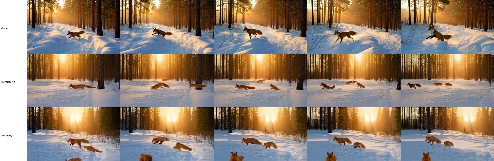
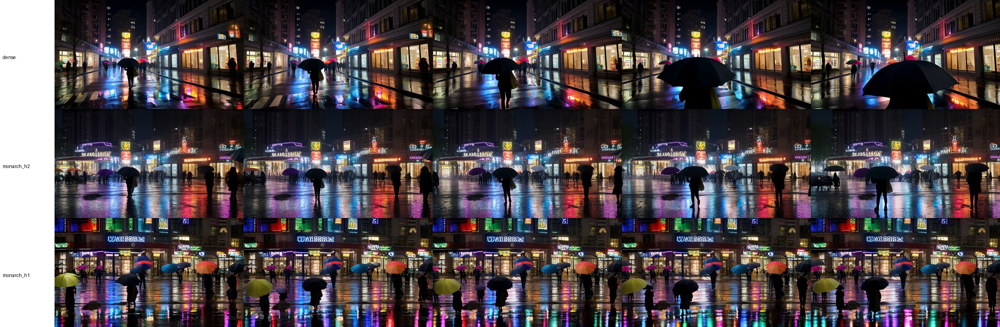

# Benchmarks and comparison

Everything below is from one machine, one day (2026-10-02), with the setup in
`docs/SETUP.md`. Raw records: `docs/results/benchmark_runs.json` (every job
and video: timings, attention dispatch counts, memory, hashes),
`docs/results/ab_summary_offload.json` (analysis), `docs/results/gpu_e2e_report.json`
(ComfyUI HTTP end-to-end run). The MP4 files are Release assets.

## Setup

| | |
| --- | --- |
| GPU | NVIDIA GeForce RTX 5090 32 GB, driver 595.95, shared with the Windows desktop (about 2.1 GB in use at idle) |
| Runtime | WSL2 Ubuntu 24.04 (31 GB memory limit), Python 3.10.22, torch 2.8.0+cu128, triton 3.4.0, flash-attn 2.8.3, flashinfer 0.6.3 |
| Upstream | Infini-AI-Lab/MonarchRT `34867c0`, unmodified |
| Weights | Wan2.1-T2V-1.3B `37ec512` + Self-Forcing `self_forcing_dmd.pt` `2f8b779` (`generator_ema`), bf16 |
| Video | 480x832, 21 latent frames -> 81 RGB frames, batch 1, 4 denoising steps per block of 3 latent frames |
| Models on disk | NTFS drive mounted in WSL2 (`/mnt/...`); this makes model loading and the first text encoding slow |
| Offload | `offload_text_encoder: true` (what upstream `inference.py` does below 40 GB free VRAM) unless stated |

Prompts (written for this test, used verbatim, no prompt extension):

1. A red fox trotting through fresh snow in a quiet pine forest at sunrise, warm golden light filtering between the trees, the camera tracking alongside at ground level.
2. Ocean waves crashing against dark volcanic rocks on a stormy coastline, white spray bursting into the air, overcast sky, cinematic wide shot.
3. A rainy city street at night lit by neon signs, people with umbrellas walking past glowing shop windows, colorful reflections shimmering on the wet pavement.

Seeds 101 and 2026 -> 6 videos per profile. Each job is one process: a
warm-up video (prompt 1, seed 101) followed by the 6 videos, so the 6 are
"warm" (model loaded, kernels compiled and tuned in this process). For every
profile the initial noise is identical (`torch.manual_seed(seed)` before
`torch.randn`), and so are prompt, weights, dtype and chunking.

## Speed (warm, per 81-frame video, mean of 6, [min-max])

| Profile | Generator forwards (35) | of which 28 denoise / 7 context | VAE decode | Text encode (offloaded T5) | Inference total | Generator frames/s |
| --- | --- | --- | --- | --- | --- | --- |
| dense | 6.60 s [6.42-7.15] | 5.20 / 1.29 s | 2.75 s | 1.43 s | 10.98 s [10.61-11.58] | 12.3 |
| monarch_h2 | 4.91 s [4.72-5.36] | 4.03 / 1.04 s | 2.80 s | 1.61 s | 9.47 s [9.05-10.65] | 16.5 |
| monarch_h1 | 4.17 s [4.07-4.22] | - | 2.78 s | 1.51 s | 8.72 s [8.57-9.03] | 19.4 |
| dense (again, after Monarch) | 6.49 s [6.40-6.67] | - | 2.87 s | 1.49 s | 11.05 s [10.59-11.35] | 12.5 |

- Generator speed-up over dense: 1.34x (`monarch_h2`), 1.58x (`monarch_h1`).
  End-to-end inference (text encode + generator + VAE): 1.16x and 1.26x.
- The denoise/context split comes from the reverse-order runs (same
  settings, same runner apart from added timers).
- "Generator frames/s" is 81 frames / generator seconds, i.e. throughput of
  the diffusion part only. The MP4 files are written at 16 fps; that is the
  playback rate, not a generation speed. End-to-end throughput including
  VAE and text encoding is 81 / inference total (7.4, 8.6, 9.3 frames/s), so
  none of these runs is real-time 16 FPS generation end to end.
- MP4 writing (H.264, CRF 18) adds about 0.45 s per video; model loading
  27-35 s per process (weights on the NTFS mount).

### Cold start (first video of a process)

| | dense | monarch_h2 | monarch_h1 |
| --- | --- | --- | --- |
| Generator, first video | 6.9 s | 143.5 s | 146.3 s |
| Text encode, first video | 57.5 s | 59.4 s | 58.0 s |
| Whole process (load + 7 videos) | 175 s | 310 s | 304 s |

The Monarch kernels are autotuned per KV-cache length (7 lengths per video).
On the very first run after installation this took about 107 s per length
(compile + tune); with the compiled kernels cached in `TRITON_CACHE_DIR` it
is about 20 s per length in every new process, because the autotune timing
still runs (the upstream README describes this). The first text encoding reads
the 11 GB T5 file from the NTFS mount. Generate several videos per job to
amortise both.

### Memory

| | dense | monarch_h2 / h1 |
| --- | --- | --- |
| torch max allocated | 12.8 GiB | 12.8 GiB |
| torch max reserved | 16.0 GiB | 17.0 GiB |
| whole GPU (nvidia-smi, includes the desktop) | 19.1 GB | 22.3 GB |
| WSL2 process peak RSS | 19.2 GiB | 19.9 GiB |

These are observed peaks for this configuration, not minimum requirements.

### Without text-encoder offload (32 GB card)

Keeping the 11 GB T5 encoder on the GPU makes dense slightly faster
(inference total 9.4 s, peak 28.9 GB on the whole GPU) but pushed the
Monarch processes to 31.8 of 32.6 GB. On Windows/WSL2 the driver then falls
back to shared system memory instead of failing: `monarch_h2` warm videos
slowed to 8.7 s generator on average (4.96 s for the first warm video, then
9.2-9.9 s) and the VAE slowed from 2.7 s to about 5 s. That is why offload is
recommended below 40 GB, as upstream does. These runs are kept in the
manifest (`ab_*` jobs).

## Correctness checks

- Attention dispatch, counted per video: dense 1050 dense self-attention
  calls; Monarch profiles 1050 `monarch_attn_with_kv_cache` calls, all 1050 in
  the fused Triton kernel, 0 PyTorch fallback, 0 dense self-attention; text
  cross-attention 1050 dense calls in every profile. Forward counts 28
  denoise + 7 context per video. The runner fails a job if this does not hold.
- Kernel vs reference (no grad, inference geometry 30x52 tokens per frame, 12
  heads): cosine 0.99997, relative L2 0.008-0.0085, bf16 `allclose` and
  identical KV-cache writes for h_reduce 1 and 2 at KV lengths of 3, 12 and 21
  frames.
- EMA weights: 825/825 tensors, no missing/unexpected keys, probe tensor
  changed and equals the EMA value.
- Residue: dense -> Monarch -> dense gives bit-identical dense files (max pixel
  difference 0). Within one process, a repeat of the first video is
  bit-identical, and generating the 6 videos in reverse order gives the same
  6 files for dense and for `monarch_h2` (KV and cross-attention caches are
  reset between videos).
- All MP4 files decode completely: 81 frames, 832x480, H.264, 16 fps.

## Output comparison

Dense and Monarch outputs are not expected to match pixel-wise, and they do
not: with the same noise the autoregressive rollout diverges.

| vs dense, same prompt/seed/noise | PSNR | SSIM (luma) | mean frame-to-frame change (dense 7.20) |
| --- | --- | --- | --- |
| monarch_h2 | 12.9 dB | 0.41 | 6.76 |
| monarch_h1 | 10.5 dB | 0.31 | 5.42 |

Frame review of all 18 Monarch videos (frames 0, 20, 40, 60, 80 next to dense):

- `monarch_h2`: coherent, prompt-following videos in 6 of 6 cases, no
  collapsed or noisy frames. Differences to dense: camera motion is often
  reduced, and in one of six videos (prompt 1, seed 101) the single fox
  becomes two or three foxes.
- `monarch_h1`: visibly weaker: duplicated and close-up foxes in both fox
  videos, a smeared, repeated texture along the bottom edge in one wave
  video, more static scenes. This matches the upstream statement that the
  95% setting needs training for high quality.

These are six prompt/seed pairs reviewed by eye plus two simple metrics, not a
quality benchmark (no VBench or user study). They show neither quality
parity nor a systematic failure.
